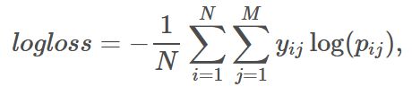

# State Farm Driver Detection Challenge

According to the CDC motor vehicle safety division, one in five car accidents is caused by a distracted driver. Sadly, this translates to 425,000 people injured and 3,000 people killed by distracted driving every year.

State Farm hopes to improve these alarming statistics, and better insure their customers, by testing whether dashboard cameras can automatically detect drivers engaging in distracted behaviors. Given a dataset of 2D dashboard camera images, State Farm is challenging Kagglers to classify each driver's behavior. Are they driving attentively, wearing their seatbelt, or taking a selfie with their friends in the backseat?

## Dataset Provided

In this competition you are given driver images, each taken in a car with a driver doing something in the car (texting, eating, talking on the phone, makeup, reaching behind, etc). Your goal is to predict the likelihood of what the driver is doing in each picture. 

The 10 classes to predict are:

    c0: safe driving
    c1: texting - right
    c2: talking on the phone - right
    c3: texting - left
    c4: talking on the phone - left
    c5: operating the radio
    c6: drinking
    c7: reaching behind
    c8: hair and makeup
    c9: talking to passenger

To ensure that this is a computer vision problem, we have removed metadata such as creation dates. The train and test data are split on the drivers, such that one driver can only appear on either train or test set. 

To discourage hand labeling, we have supplemented the test dataset with some images that are resized. These processed images are ignored and don't count towards your score.

## Evaluation

Submissions are evaluated using the multi-class logarithmic loss. Each image has been labeled with one true class. For each image, you must submit a set of predicted probabilities (one for every image). The formula is then,

where *N* is the number of images in the test set, *M* is the number of image class labels,  `log` is the natural logarithm, *y(i,j)* is 1 if observation *i* belongs to class *j* and 0 otherwise, and *p(i,j)* is the predicted probability that observation *i* belongs to class *j*.

## Results

Private score: 0.25056 (rank 138/1440 teams, top 10%, post competition end).

